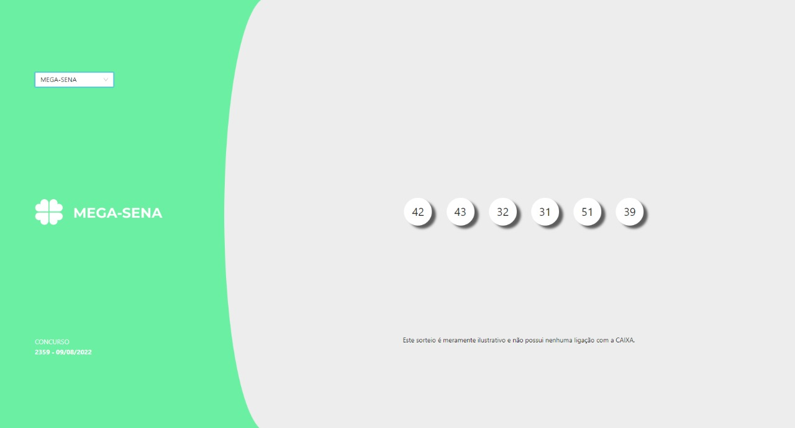
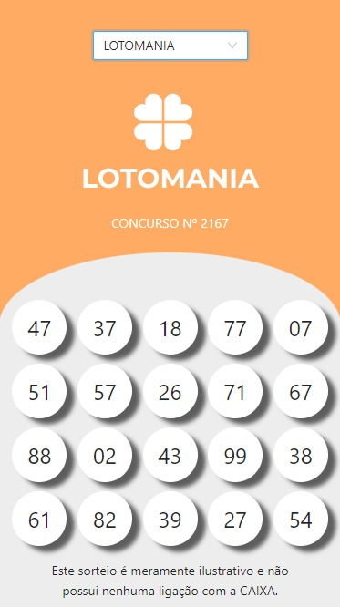
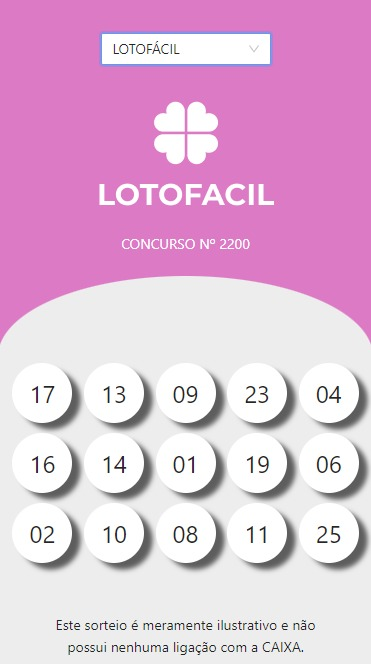
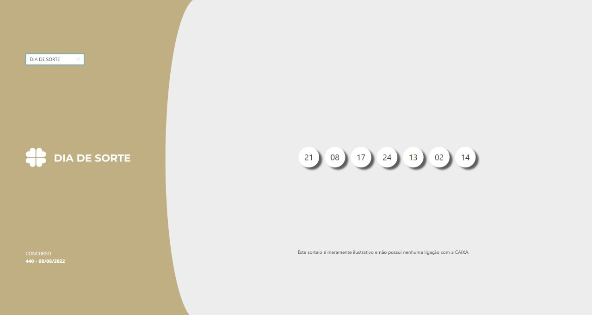

# Loteria

## Introdução

Essa é a **aplicação web front-end** que mostra os **Resultados das Loterias**. Ah,  Este sorteio é meramente ilustrativo e não possui nenhuma ligação com a CAIXA!

A aplicação suporta **6 sorteios**: Mega-sena, Quina, Lotofácil, Lotomania, Timemania e Dia de sorte. 
Cada sorteio tem seu tema com suas respectivas cores. É responsiva tendo o suporte para mobile, como ilustrado a seguir.
 

### Tecnologias utilizadas

- React com TypeScript
- Testes com React Testing Library
- Jest
- AntDesign
- Axios

### Iniciando o projeto

- Clone o repositório
- Instale as dependências na pasta raiz 
- Execute com `yarn start` e divirta-se!

### Dúvidas?

Para dúvidas, exclarecimentos e elogios, só me chamar!
 
   

 

